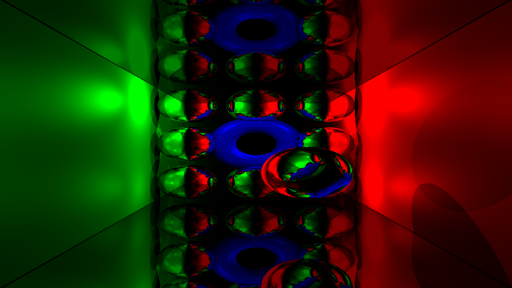

**APiR** - **A**ll **P**ossible **i**n **R**endering

**Actual progress**

**Instalation**
Next thirdparties must be installed before configuring cmake
or they will be taken from ThirdParties folder instead
1. OpenCL
2. GLUT