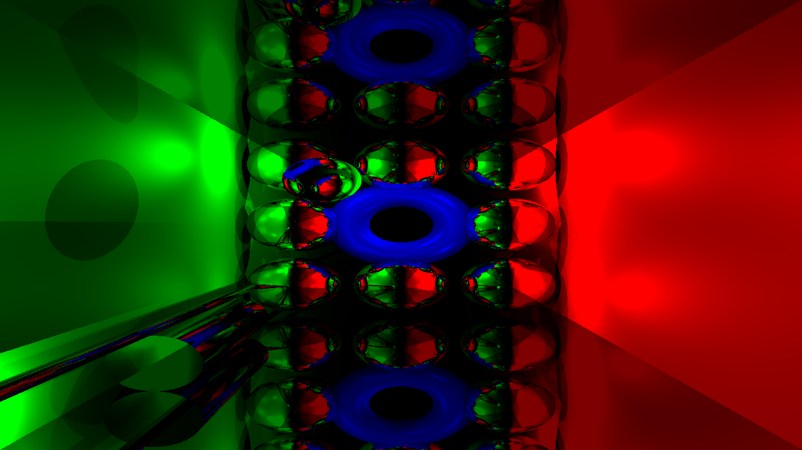

# **AKE** - **A**ll **K**inded **E**ngine

## Actual progress
### 3D Scene sample based on ray tracing analytical primitives

### 2D Scene GJK collision detection

## Installation
Next thirdparties must be installed before configuring cmake
or they will be taken from ThirdParties folder instead
1. OpenCL
2. GLUT
3. CUDA

## Feature list
- [ ] Geometry
    - [ ] 3D
        - [ ] Primitives
            - [x] Sphere
            - [x] Cylinder
            - [x] Plane
            - [x] Torus
            - [ ] Cone
            - [ ] Cube
        - [ ] Mesh
    - [ ] 2D
        - [ ] Primitives
            - [x] Circle
            - [x] Rectangle
            - [x] Triangle
        - [ ] Mesh
- [ ] Fractal
    - [ ] 2D
        - [x] Mandelbrot set
        - [x] Julia set
    - [ ] 3D
- [ ] Rendering worflow
    - [ ] 3D
        - [ ] RayTracing
            - [x] CPU version
            - [ ] CUDA version
            - [ ] Techniques
                - [ ] Soft shadows
                - [ ] TAA (temporal anti aliasing)
        - [ ] RayMarching
        - [ ] PathTracing
        - [ ] Rasterizer
    - [ ] 2D
        - [x] Simple drawers based on OpenGL primitives
- [ ] Physic
    - [ ] 2D
        - [ ] GJK collision detection
            - [x] Circle
            - [x] Triangle
            - [x] Rectangle
            - [ ] Convex
- [ ] Serialization
- [ ] Python wrapper
- [ ] Camera
    - [x] Simple controller
    - [ ] Lens
- [ ] Memory
    - [x] Custom vector
    - [x] CUDA managed memory pointer/allocator
    - [x] CUDA device memory pointer/allocator
    - [x] Memory manager
- [ ] Lighting
    - [x] Spot light
    - [ ] Direction light
    - [ ] Object light emmiter
- [x] Window
    - [x] Events
        - [x] Mouse
            - [x] Button pressed
            - [x] Button released
            - [x] Scroll
        - [x] Keyboard
            - [x] Key pressed
            - [x] Key released
        - [x] Window
            - [x] Window close
            - [x] Window resize
    - [x] Event listener
    - [x] GLUT window
    - [x] GLFW window
    - [ ] SDL2 window
    - [x] ImGui functionality
        - [x] Debug gui(fps etc)
