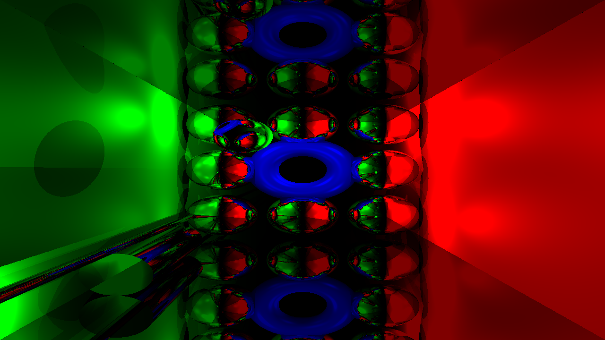

# States

## State 3
Finilize main analitical primitives (sphere, plane, torus, cylinder)

## State 2
Add torus and improving quality
.png)

## State 1
Added mirrors and specular coloring via material
.png)

## State 0
Created simple shapes, spot light source and diffuse coloring
.png)